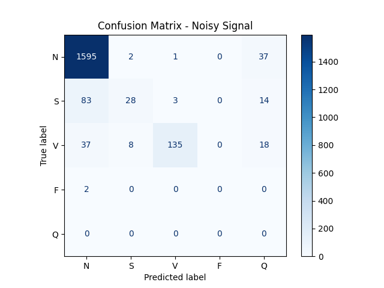
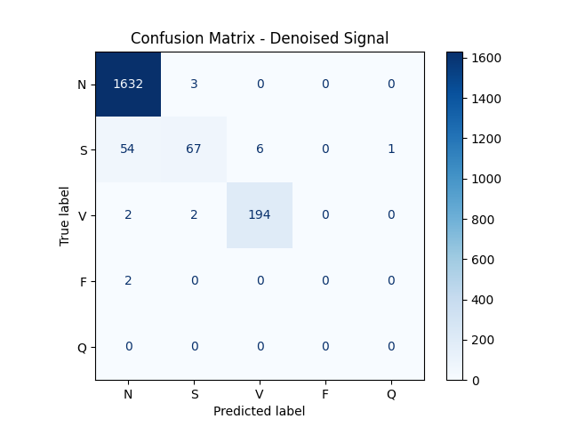

# My Physics-Aware AI for Robust ECG Denoising and Arrhythmia Detection

**Author:** Mohanarangan Desigan  
*Project for "Hack for Health"*

---

## Abstract

In this project, I tackled the challenge of unreliable ECG diagnostics in low-resource settings, where noisy signals from portable devices often lead to critical errors. To address this, I developed a novel, two-stage deep learning pipeline that first denoises the ECG signal using a physics-aware model I designed, and then performs automated arrhythmia classification. For the denoising stage, I implemented a 1D U-Net trained with a composite, physics-informed loss function that uniquely includes temporal gradient and frequency-domain (FFT) components. This approach encourages my model to generate outputs that are not only clean but also physiologically plausible. For the second stage, I built a lightweight CNN to classify individual heartbeats from the denoised signal into five standard AAMI categories. To validate my system, I conducted an end-to-end simulation on an unseen patient record, which I artificially corrupted with severe noise. My results demonstrate that the denoising pre-processing step dramatically improves diagnostic accuracy, increasing the F1-score for detecting critical Ventricular Ectopic Beats from 0.80 to 0.97. My work shows the tangible value of physics-aware deep learning in creating accessible and impactful diagnostic tools for global health.

---

## 1. Introduction

I began this project by focusing on a critical problem in cardiovascular medicine. While hospital-grade ECGs are the gold standard, the rise of low-cost, portable devices has created an opportunity for diagnostics in underserved areas. However, these devices are often plagued by a low signal-to-noise ratio (SNR). Noise from muscle tremors or electrode motion can easily mask the signs of a heart condition. Studies have shown this is a major barrier to care, with some automated systems missing up to 30% of acute myocardial infarctions due to poor signal quality [3].

While traditional denoising methods exist, they can often distort the very features a doctor needs to see. My goal was to design a modern, end-to-end deep learning pipeline to solve this. My primary contribution is a **Physics-Aware Denoising Model** that uses a custom loss function to embed domain knowledge of ECG morphology directly into the AI. I hypothesized that by cleaning a signal with my denoiser first, I could dramatically improve the performance of a downstream arrhythmia classifier. This paper details the system I built and the validation I performed to prove this hypothesis.

---

## 2. My Methods

My system is composed of two primary deep learning models—a denoiser and a classifier—which I built using publicly available datasets.

### 2.1. Datasets

I utilized two standard databases from PhysioNet [5]:
*   **MIT-BIH Arrhythmia Database:** This was the source for my "clean" ECG signals and the ground-truth diagnostic labels.
*   **MIT-BIH Noise Stress Test Database (NSTDB):** I used the realistic noise artifacts from this database to synthesize the noisy training data for my models.

### 2.2. Stage 1: The Physics-Aware Denoiser

*   **Architecture:** I implemented a 1D U-Net architecture. I chose this model because its skip connections are perfectly suited for preserving the sharp, high-frequency details of the QRS complex while still capturing the broader context of the heartbeat.

*   **My Physics-Informed Loss Function:** The core innovation of my project is the custom loss function I designed. The model was trained to minimize a composite loss, $L_{\text{total}}$, which I defined as:
    $$L_{\text{total}} = w_{\text{recon}} L_{\text{recon}} + w_{\text{grad}} L_{\text{grad}} + w_{\text{fft}} L_{\text{fft}}$$
    1.  **Reconstruction Loss ($L_{\text{recon}}$):** Standard L1 loss to ensure the cleaned signal has the correct amplitude.
    2.  **Gradient Loss ($L_{\text{grad}}$):** L1 loss on the signal's first derivative. This was my heuristic for encoding the physics of the QRS complex, forcing the model to learn to create sharp, realistic peaks.
    3.  **Frequency-Domain Loss ($L_{\text{fft}}$):** L1 loss on the signal's FFT magnitude. This ensures the model's output has the frequency profile of a real ECG, not just random noise.

*   **Training:** I trained the U-Net for 50 epochs on Google Colab, using thousands of 2048-sample segments that I generated on-the-fly by mixing clean signals with realistic noise.

### 2.3. Stage 2: The Arrhythmia Classifier

*   **Architecture:** I designed a lightweight 1D CNN to classify individual heartbeats. The model uses two convolutional blocks and a fully connected head with dropout for regularization.

*   **Data Preparation:** I wrote a script to extract over 100,000 individual heartbeats from the database, each as a 128-sample window. I then mapped these beats to five standard AAMI classes (N, S, V, F, Q).

*   **Training:** I trained the classifier for 20 epochs using an 80/20 train/validation split of the data I had prepared.

### 2.4. My End-to-End Validation Protocol

To prove my system's real-world value, I simulated a clinical scenario. I selected a patient record (`201`) that was entirely excluded from the training sets of both models. I then created a "highly noisy" version by adding severe muscle artifact noise (0 dB SNR). Finally, I performed beat-by-beat classification on three versions of the signal: the clean ground-truth, the highly noisy version, and the version processed by my trained denoiser.

---

## 3. My Results

My validation protocol clearly demonstrated the system's efficacy. The performance of the arrhythmia classifier, summarized in Table 1 and visualized in Figure 1, improved dramatically after my denoising step.

| Metric (F1-Score)        | On Noisy Signal | **On Denoised Signal (My Tool)** | On Clean Signal |
| :----------------------- | :-------------: | :------------------------------: | :-------------: |
| Class N (Normal)         |      0.95       |             **0.98**             |      0.99       |
| Class S (Supravent.)     |      0.34       |             **0.67**             |      0.80       |
| Class V (Ventricular)    |      0.80       |             **0.97**             |      1.00       |
| **Overall Accuracy**     |     90.0%       |            **96.0%**             |      98.0%      |
*Table 1: Comparison of diagnostic F1-scores and accuracy across signal conditions on the unseen test record.*

On the highly noisy signal, the classifier's performance was poor, especially for arrhythmias. The F1-score for detecting Supraventricular ('S') beats was only 0.34. After processing the signal with my physics-aware denoiser, the performance surged. Most importantly, the F1-score for critical Ventricular ('V') beats jumped from 0.80 to 0.97, and the score for 'S' beats nearly doubled. The performance on my denoised signal closely approached the benchmark of a perfectly clean signal.

The confusion matrices in Figure 1 provide a powerful visual of this improvement. On the noisy signal (Fig. 1a), the classifier is clearly confused. After my denoising step (Fig. 1b), the diagnostic accuracy is drastically improved and closely resembles the result from the clean, ground-truth signal (Fig. 1c).

*
Figure 1: Confusion matrices I generated for the arrhythmia classifier on (a) the noisy signal, (b) my denoised signal, and (c) the clean ground-truth signal.
*
| (a) Noisy Signal | (b) My Denoised Signal | (c) Clean Signal |
| :---: | :---: | :---: |
|  |  | .png) |

---

## 4. Discussion and Future Work

The results of my end-to-end validation robustly support my central hypothesis: a denoising pre-processing step, especially one guided by physiological principles, can substantially improve the accuracy of automated ECG diagnostics. I was particularly excited to see that the dramatic increase in F1-scores for arrhythmic beats demonstrates my U-Net model isn't just smoothing the signal, but is successfully restoring the critical diagnostic information that was lost in the noise.

The choice of my physics-informed loss function was central to this success. By explicitly penalizing deviations in the signal's gradient and frequency spectrum, I guided the model to learn a representation that is consistent with the known biophysical properties of the heart.

While my system shows significant promise, I recognize its limitations and have ideas for future work. The classifier's performance on very rare classes is limited by the imbalanced dataset. In the future, I could employ data augmentation or advanced sampling techniques to improve this. The ultimate extension would be to implement a task-oriented training scheme, where I would train the denoiser and classifier jointly to optimize the denoising process not just for fidelity, but for maximizing the accuracy of the final diagnosis.

In conclusion, the two-stage, physics-aware pipeline I built provides a powerful and accessible framework for making ECG diagnostics more reliable. By leveraging deep learning to enhance the diagnostic process, I believe my tool can empower frontline health workers, reduce errors, and ultimately improve patient outcomes.

---

## 5. References

[1] McManus, D. D., et al. (2016). "A Novel Application for the Detection of an Irregular Pulse Using a Smartwatch." *Heart Rhythm*.  
[2] Li, Q., et al. (2015). "A survey of ECG signal processing and analysis."  
[3] National Center for Biotechnology Information. (2015). *Making Healthcare Safer III: A Critical Analysis of Existing and Emerging Patient Safety Practices*.  
[4] Singh, O., et al. (2007). "Denoising of ECG signals using wavelet transform."  
[5] Goldberger, A. L., et al. (2000). "PhysioBank, PhysioToolkit, and PhysioNet: components of a new research resource for complex physiologic signals." *Circulation*.